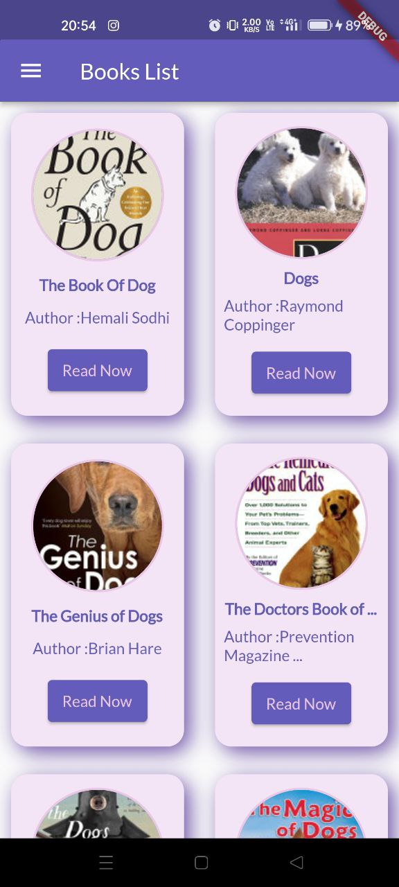
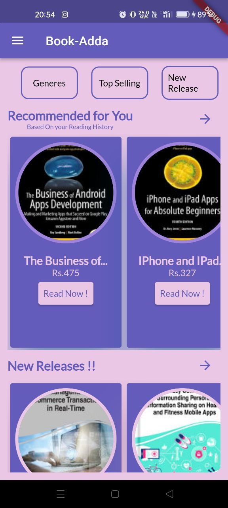
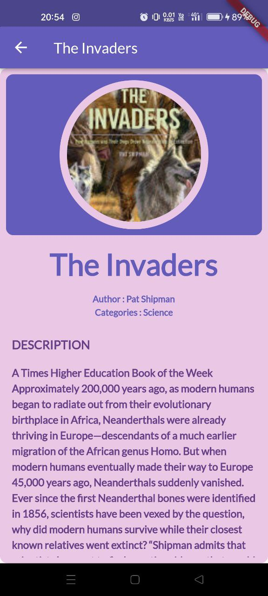
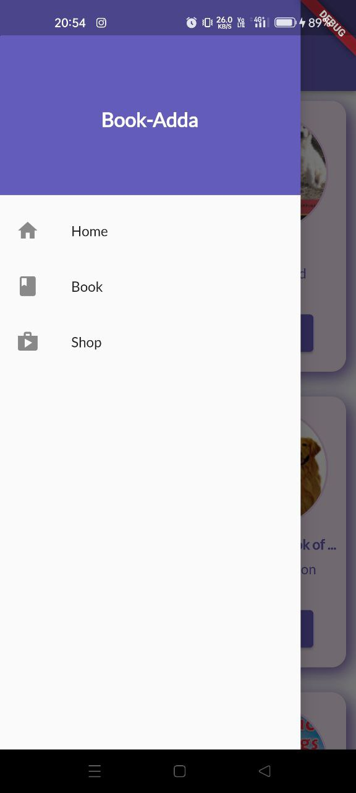
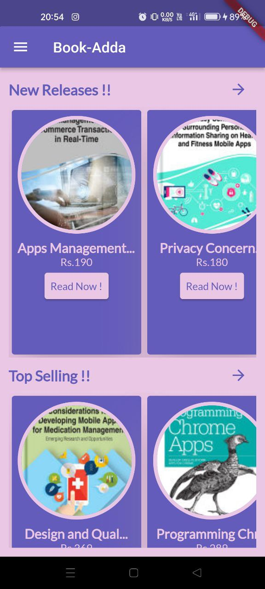

# BookAdda

#### Created BookStore App like Google Play Books using Google Books API. 
#### Fetched Book Data and implemented in the Flutter App.
#### Smooth UI DESIGN and responsive App Design.

## Screenshots of the Application:-
 
  
  
  
  
  
